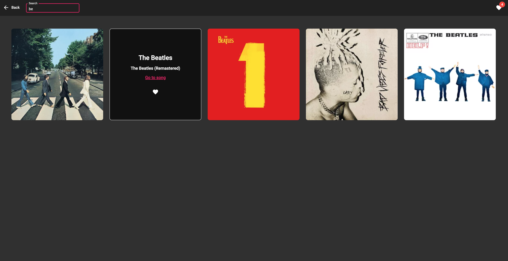

# MusicLibrary

See demo by [this link](https://zoromari.github.io/music-library/) 

## Functionality
This is your library of music in main genres. 

You can find the most popular albums in the selected genre, find out the album title and singer name, and go to the page to listen to songs from the album. 

You can also add albums into your favorites and use it to store and filter them as well as use the seach input to find necessary albums by title or singer. 

## Technologies:
This project was generated with Angular CLI version 14.0.5. For this project, I used the Material components and theme. API for music albums: https://www.last.fm/api

